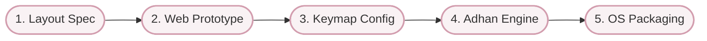

# Yazhi Tamil Keyboard (Thozhan)

An open-source Tamil keyboard reimagined with Tholkappiam (PM0100) principles.

## Philosophy: PM0100 Unit Pairs

Instead of traditional layouts (QWERTY-phonetic or Tamil99), we are designing a layout based on the phonological units defined in Tholkappiam.

**Core Concept:** Sounds are grouped in natural pairs or units:
- A (அ) / Aa (ஆ)
- E (இ) / Ee (ஈ)
- U (உ) / Uu (ஊ)

## Keyboard Layout (Tholkappiam PM0100)

Here is a visual representation of the core layout based on the PM0100 principles:

### Default Layer (Base)
|   |   |   |   |   |   |
|:---:|:---:|:---:|:---:|:---:|:---:|
| அ | இ | உ | எ | ஒ | ஐ |
| க் | ச் | ட் | த் | ப் | ற் |
| ங் | ஞ் | ண் | ந் | ம் | ன் |
| ய் | ர் | ல் | வ் | ழ் | ள் |

### Shift Layer (Long Vowels & Consonants)
|   |   |   |   |   |   |
|:---:|:---:|:---:|:---:|:---:|:---:|
| ஆ | ஈ | ஊ | ஏ | ஓ | ஔ |
| க | ச | ட | த | ப | ற |
| ங | ஞ | ண | ந | ம | ன |
| ய | ர | ல | வ | ழ | ள |

## Goals
- Intuitive typing flow based on sound duration (Maatthirai) and relationship.
- Support for modern platforms (Mobile/Web/Desktop).
- Privacy-focused (local processing).

## Roadmap

1. [ ] **Define the full layout spec** (Vowels, Consonants, Grantha).
2. [ ] **Prototype a web-based testing ground** (with offline caching).
3. [ ] **Build keymap configuration**.
4. [ ] **Integrate Adhan** (Local Processing & Prediction Engine).
5. [ ] **Package for target OS** (Android/iOS/Linux).
